# Sneaker Shopping ProKit – UI Demo

A Flutter demo app for a sneaker shopping experience UI.  
This is a **UI-only** project with no backend or actual shopping functionality.

---

## 📱 Overview

The app includes design elements for:

- Sneaker product listings
- Shopping cart functionality
- User profile and payment screens
- Product details and reviews

---

## 🔍 Status

**Demo only** – No backend or actual shopping functionality.

---

## 📸 Screenshots

<table>
  <tr>
    <td>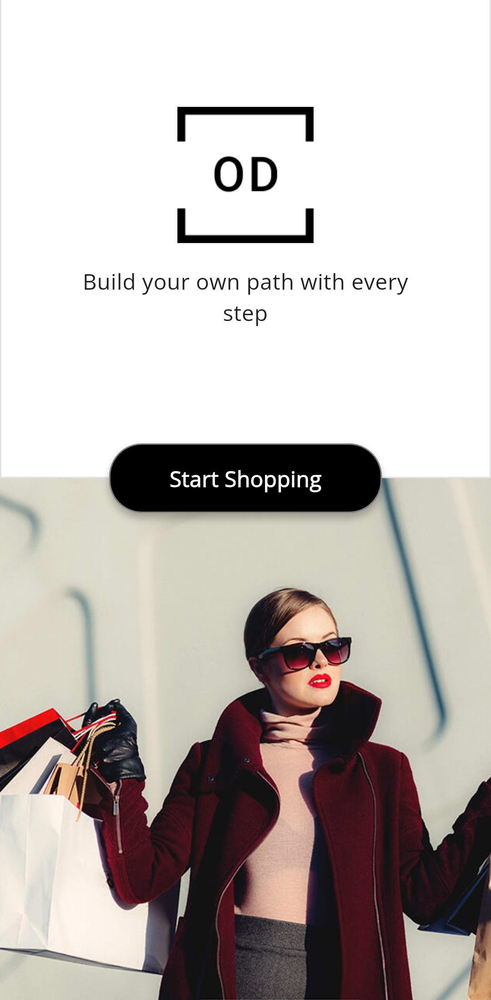</td>
    <td>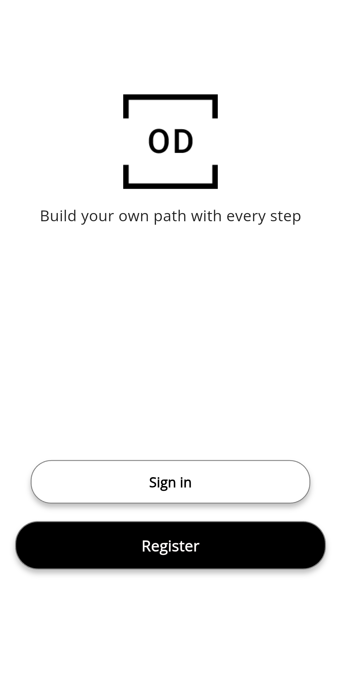</td>
    <td>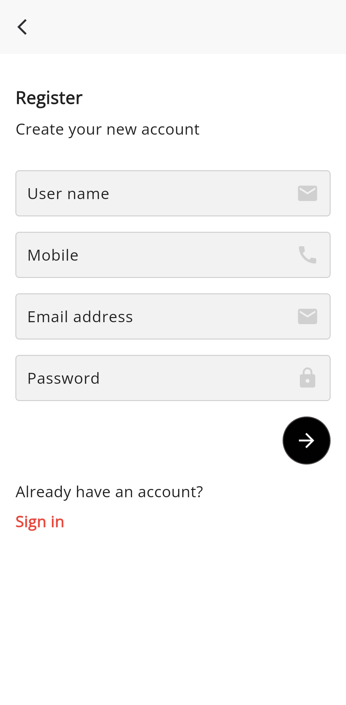</td>
    <td></td>
  </tr>
  <tr>
    <td>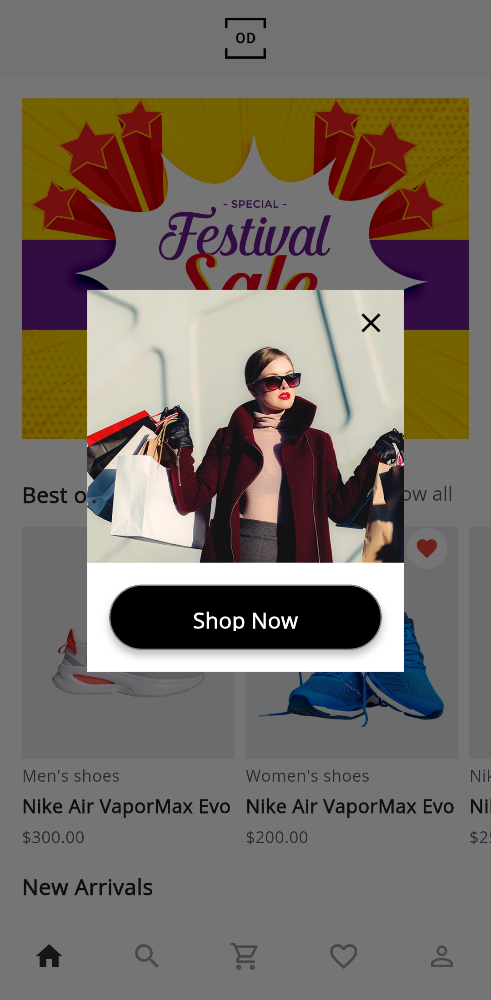</td>
    <td>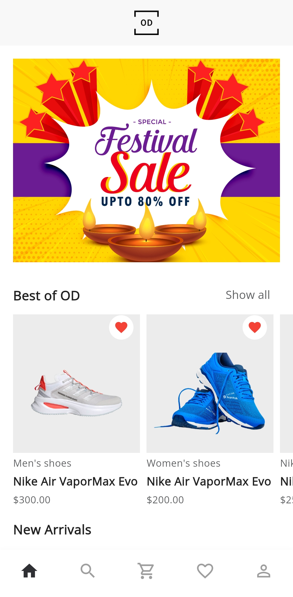</td>
    <td>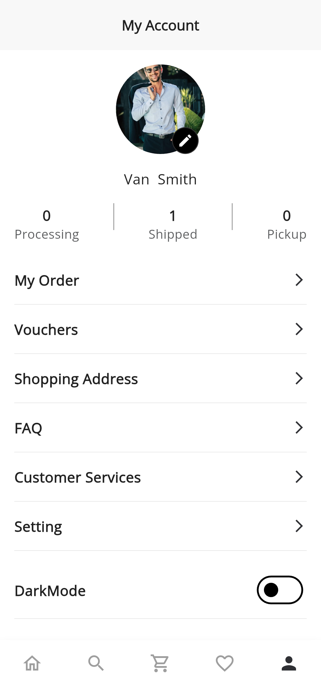</td>
    <td>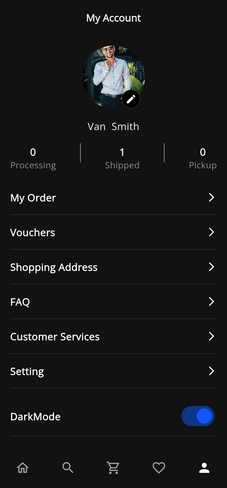</td>
  </tr>
  <tr>
    <td></td>
    <td>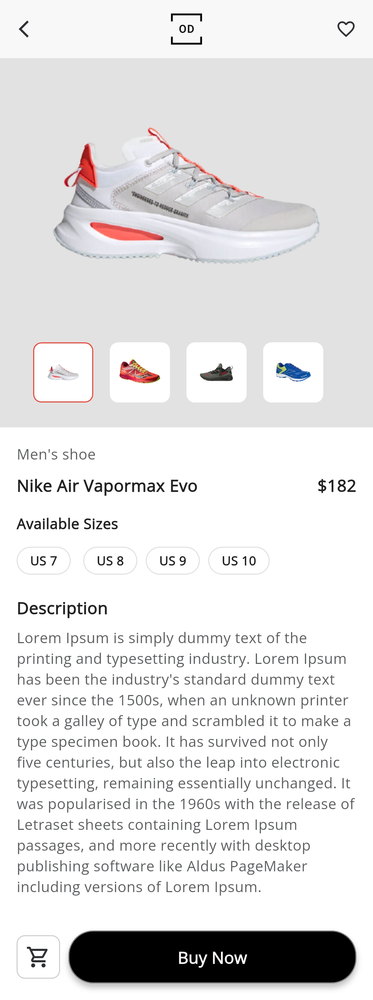</td>
    <td>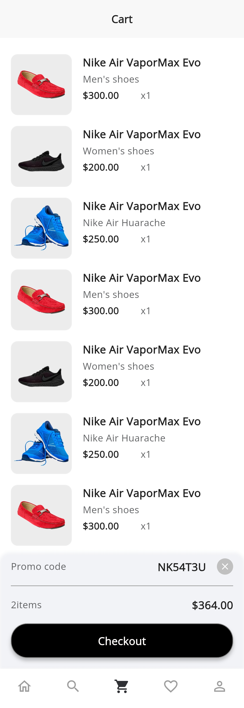</td>
    <td>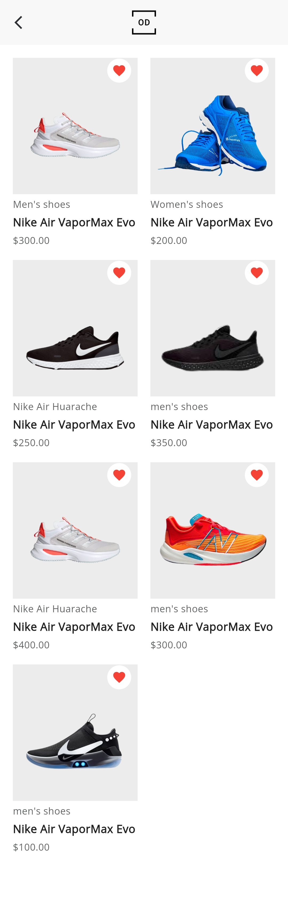</td>

  </tr>
  <tr>
    <td>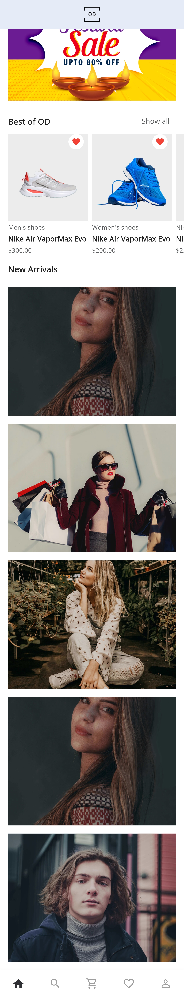</td>
    <td></td>
    <td></td>
    <td></td>
  </tr>
</table>

---

## 📝 Notes

- Built entirely with Flutter
- Clean, modular UI components
- Great starting point for any e-commerce or shopping app

---

## ✍️ Created by

**Mohamed Ebrahim**
